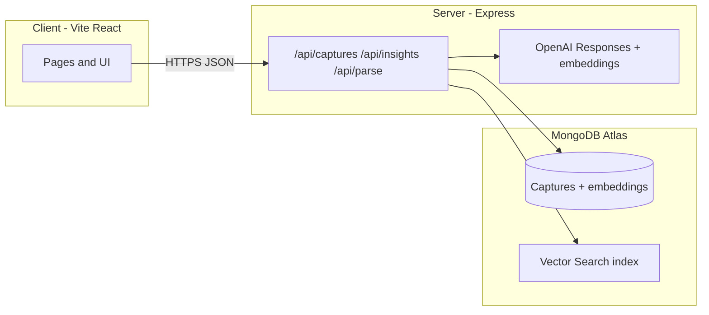

# Authenticity Engine

**Authenticity Engine** is a personal reflection app: save **captures** (short ideas or article links), get **AI tags, category, and summary**, store **embeddings** for meaning-based similarity, and explore **“who you’re becoming”**-style insights from your history.

---

## Screenshots

<p align="center">
  <a href="./docs/readme/screenshot-home.svg" title="Home — replace with PNG when ready">
    
  </a>
  <a href="./docs/readme/screenshot-insight.svg" title="Insight — replace with PNG when ready">
    
  </a>
</p>

**Using real screenshots:** Export two PNGs (e.g. ~900px wide), add them as `docs/readme/home.png` and `docs/readme/insight.png`, then in this README swap the `img src` paths to `./docs/readme/home.png` and `./docs/readme/insight.png` (and remove the placeholder SVGs if you like).

---

## Tech stack

| Layer | Technologies |
|--------|----------------|
| **Frontend** | React, Vite, Tailwind CSS, React Router |
| **Backend** | Node.js, Express, Mongoose |
| **Data** | MongoDB Atlas (documents + **Vector Search**) |
| **AI** | OpenAI — `gpt-4o-mini`, `text-embedding-3-small`; structured output via **Responses API + Zod** |

---

## Live demo

**[Open live app (Vercel)](https://example.com)** — *Replace `https://example.com` in this file with your production URL (e.g. `https://your-app.vercel.app`).*

In Vercel: **Import** this repo, set **Root Directory** to `client/`, and add **`VITE_API_BASE`** (your public API origin, no trailing slash) under **Environment Variables** for Production (and Preview if you use previews).

---

## Architecture (high level)



- **Captures:** CRUD, URL → article text + thumbnail (`parse` / fetch pipeline), then **label + embed** and persist.  
- **Similar notes:** `$vectorSearch` on stored embeddings (index name **`vector_index`**).  
- **Insights:** retrieve recent captures → LLM with project prompts → structured snapshot output.

---

## Local development

```bash
git clone https://github.com/sumin6475/authenticity-engine.git
cd authenticity-engine
```

**Server** (`server/`)

```bash
cd server
npm install
```

Example `server/.env`:

```env
MONGODB_URI=mongodb+srv://...
OPENAI_API_KEY=sk-...
PORT=5000
```

```bash
npm start
```

**Client** (`client/`, second terminal)

```bash
cd client
npm install
```

`client/.env` or `.env.local`:

```env
VITE_API_BASE=http://localhost:5000
```

```bash
npm run dev
```

---

## MongoDB Atlas — Vector Search

On the **`captures`** collection, create a Vector Search index named **`vector_index`** (must match the server code):

```json
{
  "fields": [
    {
      "type": "vector",
      "path": "embedding",
      "numDimensions": 1536,
      "similarity": "cosine"
    }
  ]
}
```

---

## Deploy notes

- **Frontend (Vercel):** root for deploy is typically **`client/`**; set **`VITE_API_BASE`** to your public API URL.  
- **Backend (e.g. Railway):** set **`MONGODB_URI`**, **`OPENAI_API_KEY`**, **`PORT`**; allow CORS for your Vercel origin if needed.

---

## Repo layout

```
authenticity-engine/
├── client/          # Vite + React
├── server/          # Express + Mongoose + OpenAI
└── docs/readme/     # README assets (screenshots)
```
