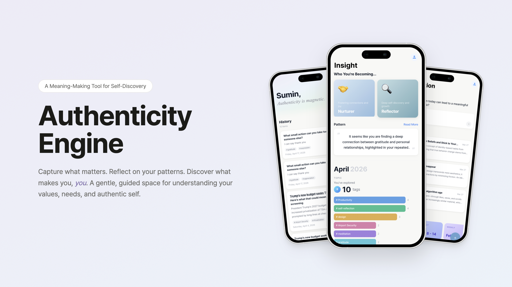
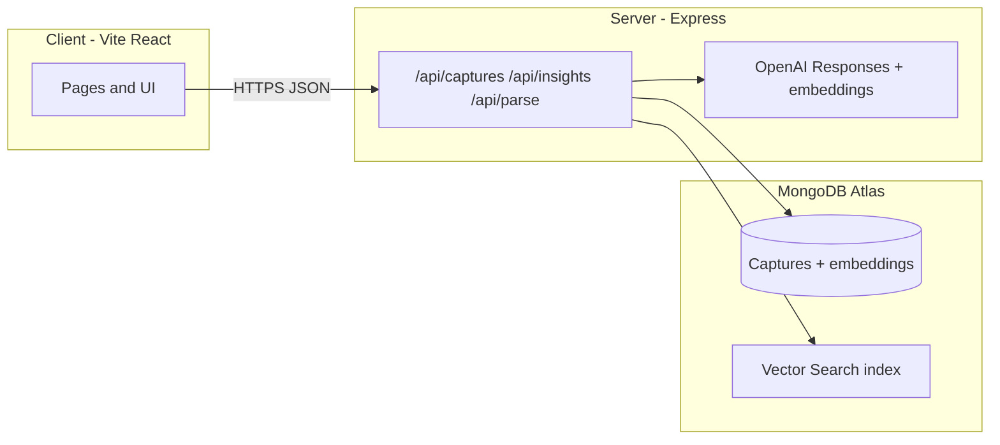

# Authenticity Engine

**Authenticity Engine** is a personal reflection app: save **captures** (short ideas or article links), get **AI tags, category, and summary**, store **embeddings** for meaning-based similarity, and explore **“who you’re becoming”**-style insights from your history.

---

## Screenshot

<p align="center">
  
</p>

---

## ✨ Features

### 🔍 Semantic Similarity Search

Find past captures by **meaning**, not keywords. Search "moments I felt stuck" and surface related entries even if you never used those exact words — powered by OpenAI embeddings and MongoDB `$vectorSearch`.

### 🏷️ AI-Powered Auto-Labeling

Every capture is automatically processed by OpenAI Responses API with **Zod structured output** — generating tags, category, and summary without manual effort.

### 🔗 URL → Article Extraction

Paste any article URL; the pipeline fetches full article text and thumbnail, then runs the same label + embed flow automatically.

### 💡 "Becoming" Insights

Periodically retrieve recent captures → LLM generates structured snapshots of emerging themes in your thinking — answering "who am I becoming?" with your own data.

### 🛡️ Production-Ready

- Environment-based config for frontend (Vercel) and backend (Railway)
- CORS handling across domains
- MongoDB Atlas Vector Search with `vector_index` (1536 dimensions, cosine similarity)

---

## Tech stack

| Layer | Technologies |
|--------|----------------|
| **Frontend** | React, Vite, Tailwind CSS, React Router |
| **Backend** | Node.js, Express, Mongoose |
| **Data** | MongoDB Atlas (documents + **Vector Search**) |
| **AI** | OpenAI — `gpt-4o-mini`, `text-embedding-3-small`; structured output via **Responses API + Zod** |

---

## Live demo

**[Open live app (Vercel)](https://authenticity-engine.vercel.app)**

Set **`VITE_API_BASE`** in the Vercel project to your public API origin (no trailing slash) so the client can reach the backend.

---

## Architecture (high level)



- **Captures:** CRUD, URL → article text + thumbnail (`parse` / fetch pipeline), then **label + embed** and persist.  
- **Similar notes:** `$vectorSearch` on stored embeddings (index name **`vector_index`**).  
- **Insights:** retrieve recent captures → LLM with project prompts → structured snapshot output.

---

## Local development

```bash
git clone https://github.com/sumin6475/authenticity-engine.git
cd authenticity-engine
```

**Server** (`server/`)

```bash
cd server
npm install
```

Example `server/.env`:

```env
MONGODB_URI=mongodb+srv://...
OPENAI_API_KEY=sk-...
PORT=5000
```

```bash
npm start
```

**Client** (`client/`, second terminal)

```bash
cd client
npm install
```

`client/.env` or `.env.local`:

```env
VITE_API_BASE=http://localhost:5000
```

```bash
npm run dev
```

---

## MongoDB Atlas — Vector Search

On the **`captures`** collection, create a Vector Search index named **`vector_index`** (must match the server code):

```json
{
  "fields": [
    {
      "type": "vector",
      "path": "embedding",
      "numDimensions": 1536,
      "similarity": "cosine"
    }
  ]
}
```

---

## Deploy notes

- **Frontend (Vercel):** root for deploy is typically **`client/`**; set **`VITE_API_BASE`** to your public API URL.  
- **Backend (e.g. Railway):** set **`MONGODB_URI`**, **`OPENAI_API_KEY`**, **`PORT`**; allow CORS for your Vercel origin if needed.

---

## Repo layout

```
authenticity-engine/
├── client/          # Vite + React
├── server/          # Express + Mongoose + OpenAI
└── docs/            # e.g. app_img.png for README
```
