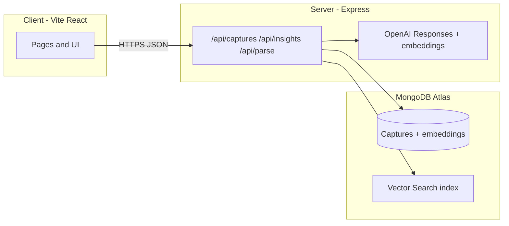

# Authenticity Engine

**Authenticity Engine** is a personal reflection app: save **captures** (short ideas or article links), get **AI tags, category, and summary**, store **embeddings** for meaning-based similarity, and explore **“who you’re becoming”**-style insights from your history.

---

## Screenshot

<p align="center">
  
</p>

---

## ✨ Features

### 🏷️ AI-Powered Auto-Labeling

Every capture is automatically processed by OpenAI Responses API with **Zod structured output** — generating tags, category, and summary without manual effort.

### 🔗 URL → Article Extraction

Paste any article URL; the pipeline fetches full article text and thumbnail, then runs the same label + embed flow automatically.

### 💡 "Becoming" Insights

Periodically retrieve recent captures → LLM generates structured snapshots of emerging themes in your thinking — answering "who am I becoming?" with your own data.

### 🛡️ Deploy-Ready

- Environment-based config for frontend (Vercel) and backend (Railway)
- CORS handling across domains
- MongoDB Atlas Vector Search with `vector_index` (1536 dimensions, cosine similarity)

---

## Tech stack

| Layer        | Technologies                                                                                    |
| ------------ | ----------------------------------------------------------------------------------------------- |
| **Frontend** | React, Vite, Tailwind CSS, React Router                                                         |
| **Backend**  | Node.js, Express, Mongoose                                                                      |
| **Data**     | MongoDB Atlas (documents + **Vector Search**)                                                   |
| **AI**       | OpenAI — `gpt-4o-mini`, `text-embedding-3-small`; structured output via **Responses API + Zod** |

---

## Architecture (high level)



- **Captures:** CRUD, URL → article text + thumbnail (`parse` / fetch pipeline), then **label + embed** and persist.
- **Similar notes:** `$vectorSearch` on stored embeddings (index name **`vector_index`**).
- **Insights:** retrieve recent captures → LLM with project prompts → structured snapshot output.

---

## Local development

```bash
git clone https://github.com/sumin6475/authenticity-engine.git
cd authenticity-engine
```

**Server** (`server/`)

```bash
cd server
npm install
```

Example `server/.env`:

```env
MONGODB_URI=mongodb+srv://...
OPENAI_API_KEY=sk-...
PORT=5000
```

```bash
npm start
```

**Client** (`client/`, second terminal)

```bash
cd client
npm install
```

`client/.env` or `.env.local`:

```env
VITE_API_BASE=http://localhost:5000
```

```bash
npm run dev
```

---

## MongoDB Atlas — Vector Search

On the **`captures`** collection, create a Vector Search index named **`vector_index`** (must match the server code):

```json
{
  "fields": [
    {
      "type": "vector",
      "path": "embedding",
      "numDimensions": 1536,
      "similarity": "cosine"
    }
  ]
}
```

---

## Deploy notes

- **Frontend (Vercel):** root for deploy is typically **`client/`**; set **`VITE_API_BASE`** to your public API URL.
- **Backend (e.g. Railway):** set **`MONGODB_URI`**, **`OPENAI_API_KEY`**, **`PORT`**; allow CORS for your Vercel origin if needed.

---

## Repo layout

```
authenticity-engine/
├── client/          # Vite + React
├── server/          # Express + Mongoose + OpenAI
└── docs/            # e.g. app_img.png for README
```


---

## Project setup & conventions (migrated from the former CLAUDE.md)

# Authenticity Engine — contributor guide

Public-facing notes for humans and coding agents working in this repository. (Private Cursor rules live in `.cursorrules`, which is gitignored.)

## What this app does

Users save **captures** (short ideas or URLs). The backend enriches them with **AI labels** (tags, category, summary), **embeddings**, and **vector similarity**. The UI surfaces **history**, **reflection prompts**, and **“who you’re becoming”**-style insights.

## Tech stack

| Area | Choice |
|------|--------|
| Frontend | React (JavaScript), Vite, Tailwind CSS, React Router |
| Backend | Node.js, Express, Mongoose |
| Database | MongoDB Atlas; **Vector Search** on captures (`embedding`, cosine) |
| AI | OpenAI SDK — `gpt-4o-mini`, `text-embedding-3-small`; structured parsing via **Responses API** + **Zod** (`zodTextFormat`) |
| Deploy | Typical setup: **Vercel** (`client/`) + **Railway** (or similar) for `server/` |

**Intentionally not in scope:** TypeScript, Next.js, Redux/Zustand, GraphQL, Prisma, Docker, client-side OpenAI calls.

## Repository layout

```
authenticity-engine/
├── client/                 # Vite app
│   └── src/
│       ├── components/
│       ├── pages/          # Home, Capture, CaptureDetail, Reflection, Insight, Profile
│       ├── utils/          # e.g. apiBase.js → VITE_API_BASE
│       ├── App.jsx
│       └── main.jsx
├── server/
│   ├── models/             # Mongoose (e.g. Capture)
│   ├── routes/             # captures, insights, parse
│   ├── services/           # OpenAI, embeddings, article fetch, prompts
│   ├── schemas/            # Zod shapes for structured output
│   └── server.js           # Express entry, MongoDB connect
├── docs/                   # README assets, etc.
├── README.md
└── CLAUDE.md               # this file
```

Logic in this codebase often lives in **route handlers** (not a separate `controllers/` layer).

## Environment variables

**Server** (`server/.env`, not committed):

- `MONGODB_URI` — required  
- `OPENAI_API_KEY` — required  
- `PORT` — optional; defaults to **5000**

**Client** (`client/.env` or `.env.local`):

- `VITE_API_BASE` — API **origin** only (no trailing slash), e.g. `http://localhost:5000` in dev; production URL on Vercel.

## HTTP API conventions

- Routes are mounted under **`/api/captures`**, **`/api/insights`**, **`/api/parse`**.  
- Prefer **`fetch` + `async/await`** on the client; base URL from `VITE_API_BASE`, paths like `` `${API_BASE}/api/captures` ``.  
- When returning JSON, use a consistent envelope where applicable: `{ success, data, error }` and meaningful HTTP status codes.

## OpenAI and data rules

- **Never** call OpenAI from the browser; only from **`server/services/`** (or routes that delegate there).  
- **Atlas Vector Search** index name used in code: **`vector_index`** on the captures collection; **1536** dimensions for `text-embedding-3-small`.

## UI / Tailwind notes

- Prefer **explicit** utilities; avoid blanket **`transition-all`** (use targeted `transition-*` / motion on transform + opacity where needed).  
- Design tokens live in **`client/src/index.css`** (CSS variables) and **`client/tailwind.config.js`**.

## Git

- Commit messages: short, imperative, English (e.g. `[client] fix capture form validation`).  
- Do not commit `.env`, API keys, or private rules files.
